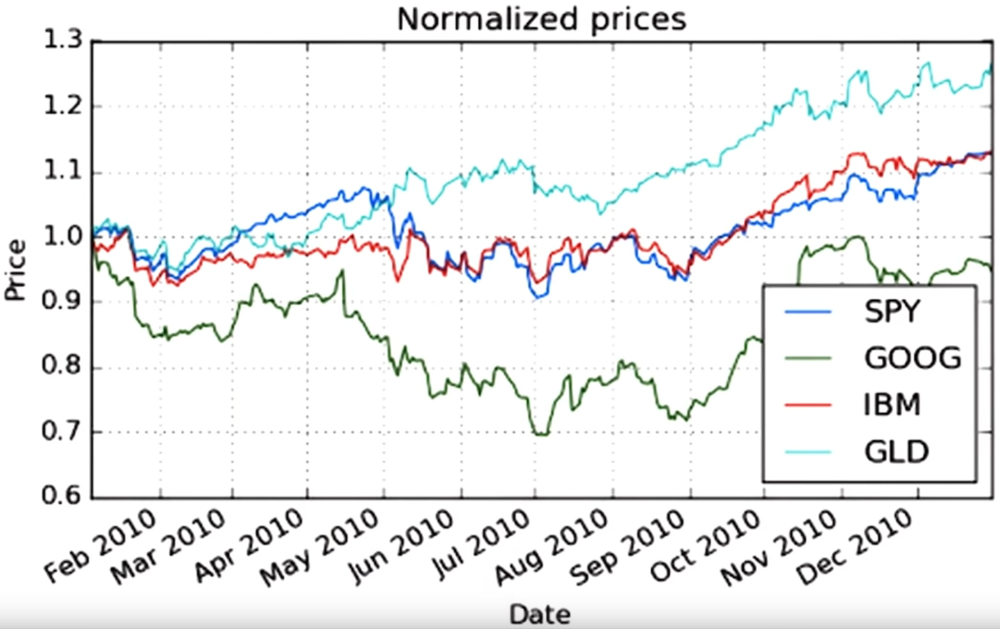
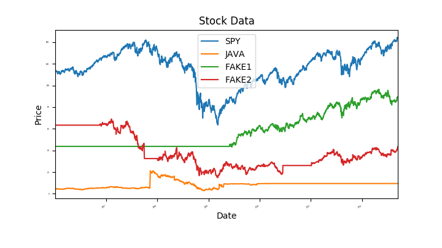

## Pandas library
General sintax and functions to know.

```python
import pandas as pd

df = pd.DataFrame(...)
df[10:21] #slicing, end not inclusive
df['Column'].max() #max value
df['Column'].mean() #mean value
df = df.join(df2) #left join for two df
df = pd.read_csv("file.csv",
                index_col = 'Date', #use 'Date' as index
                parse_dates = True, #make them date-time index objetcs
                usecols=['Date', 'Adj Close'], #specify columns to use
                na_values=['nan']) #specify sintax of Nan values
df = df.dropna() #drop all Nan values
df.join(df2, how='inner') #

#Read in more stocks
symbols = ['GOOG', 'IBM', 'GLD'] #Google, IBM and gold
for symbol in symbols:
    df_temp = pd.read_csv('data/{}.csv'.format(symbol), ...) #format for different files
    df_temp = df_temp.rename(columns = {'Adj Close': symbol}) #change column name to avoid overlad
    df = df.join(df_temp) #left join

```

* **join**:
    how{‘left’, ‘right’, ‘outer’, ‘inner’, ‘cross’}, default ‘left’

            - left: use calling frame’s index (or column if on is specified)
            - right: use other’s index.
            - outer: form union of calling frame’s index (or column if on is specified) with other’s index, and sort it lexicographically.
            - inner: form intersection of calling frame’s index (or column if on is specified) with other’s index, preserving the order of the calling’s one.
            - cross: creates the cartesian product from both frames, preserves the order of the left keys.

```python
df = df/df.iloc[0, :] #normalize data so values (price) start at 1.0
df = df.loc[start:end, colums] #slice by rows and columns
```



## Rolling statistics
Statistics calculated not for the global set of data, but for a 'window' and 'expanded' for the rest of the data set. For example, if one was to compute the _rolling mean_, we would expect the mean to sort of follow the data, but train behind and have a bit of the delay. Commonly, using this kind of statistics (and other combinations) technical indicator are built.

```python
import pandas as pd

values.rolling(window=window, center=False).mean() #computes the rolling mean for a given dataset and returns the points for it
# deprecated: pd.stats.moments.rolling_mean(...) 

df.pct_change() * 100 #computes daily returns for the dataframe
#df['Close'].pct_change * 100
```

## Incomplete data
Incomplete data is 'common' in finance. To be able to analyze it normally it has to be filled (fill or drop Nan values).

```python
df.fillna(method='ffill', inplace=True) #fills the data forwards, 'inplace' is to save the result in the same dataframe
df.fillna(method='bfill',...) #backward fill

```


## Portfolio statistics

For this first section we assume that the return is calculated daily.

```python
daily_rets = daily_rets[1:] #done to get rid of th zero at the biggining of the columns
cum_ret = (port_val[-1]/port_val[0])-1 #total return to the period
avg_daily_ret = daily_ret.mean()
std_daily_ret = daily_ret.std()
sharpe_daily_ratio = sqrt(252) * mean(daily_ret - daily_rf)/std(daily_ret)
```